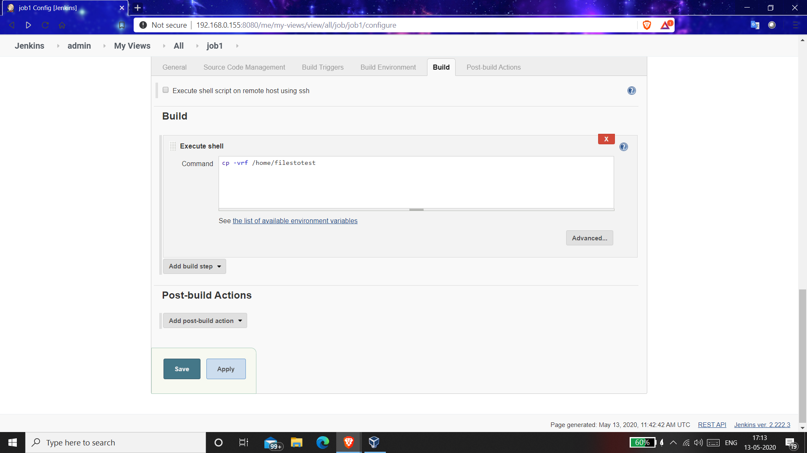

# MLOps Task 2

### 1:- At first we need to create a docker image using Dockerflie

### 2:- For creating image use command "docker build -t $(tagname) $(path) "

### 3:- After the build is complete launch docker image with patting

### 4:- Now you will be acess using browser

### 5:- Copy and paste one time password and now you can acess jenkins

### 6:- Now Create job1 with required git repository

### 7:- This job will copy the contents of the repository to local folder

